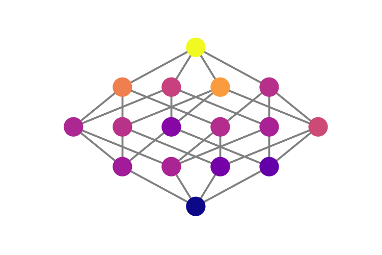

# GPGraph

**Genotype-phenotype maps in NetworkX**

Port a `GenotypePhenotypeMap` to a [NetworkX Digraph](https://networkx.github.io/). 

## Basic Example

GPGraph follows NetworkX syntax. Initialize a graph, add the
genotype-phenotype map object, and draw the graph. This library even
comes with a draw method, `draw_flattened`, suited for genotype-phenotype maps. 

```python
from gpmap.simulate import MountFujiSimulation
from gpgraph import GenotypePhenotypeGraph, draw_flattened

# Simulate a genotype-phenotype map
sim = MountFujiSimulation.from_length(4)
sim.set_roughness((-1,1))

# Turn the genotype-phenotype map into a networkx object
G = GenotypePhenotypeGraph()
G.add_gpm(gpm)

# Draw the graph
draw_flattened(G, with_labels=False, node_size=100)
```



## Install

Clone this repo and install with `pip`:

```
pip install -e .
```
